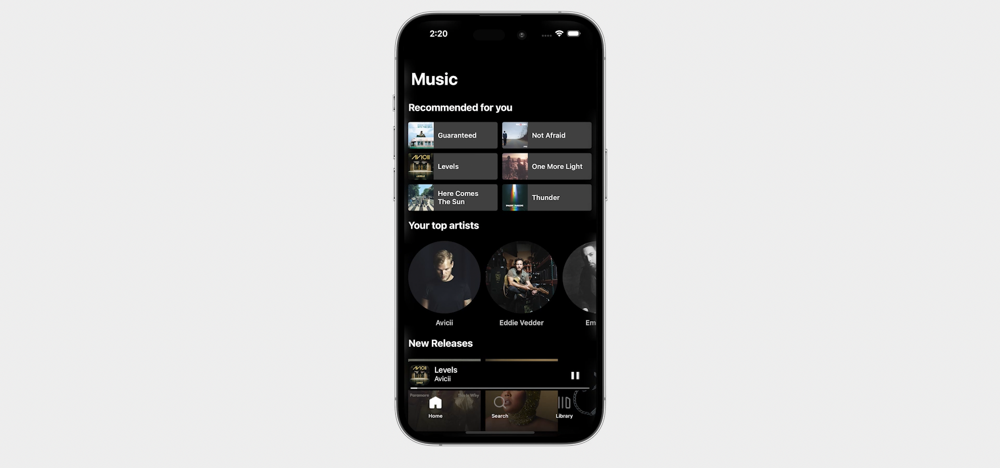

# Spotify Client | Swift & UIKit

Online Music Player for iOS based on Spotify

API: https://developer.spotify.com/documentation/web-api/



## Features 
- Recommended tracks
- Top artists
- New releases
- Playlists / Featured playlists
- Explore categories
- Search songs, artists, playlists, albums
- Save / Delete songs
- Shuffle
- Repeat

### Stack
- UIKit
- Spotify Web API

## Screenshots


| Home | Search | Library |
|  --- |  ---   |   ---   |
||||
 

## Setup project

1. Go to Spotify and create an App so you get the ClientID and Client Secret 
https://developer.spotify.com/documentation/general/guides/authorization/app-settings/
 
2. Copy the values to the file Utils/Constants.swift  
 
```bash
    static let clientID = "YOUR_CLIENT_ID"
    static let clientSecret = "YOUR_CLIENT_SECRET"
```

3. Run the project with Xcode

---

Inspired by tutorials from iOS Academy:
https://www.youtube.com/playlist?list=PL5PR3UyfTWve9ZC7Yws0x6EGjBO2FGr0o


## Licence

```
MIT License

Copyright (c) 2023 Salvador Valverde

Permission is hereby granted, free of charge, to any person obtaining a copy
of this software and associated documentation files (the "Software"), to deal
in the Software without restriction, including without limitation the rights
to use, copy, modify, merge, publish, distribute, sublicense, and/or sell
copies of the Software, and to permit persons to whom the Software is
furnished to do so, subject to the following conditions:

The above copyright notice and this permission notice shall be included in all
copies or substantial portions of the Software.

THE SOFTWARE IS PROVIDED "AS IS", WITHOUT WARRANTY OF ANY KIND, EXPRESS OR
IMPLIED, INCLUDING BUT NOT LIMITED TO THE WARRANTIES OF MERCHANTABILITY,
FITNESS FOR A PARTICULAR PURPOSE AND NONINFRINGEMENT. IN NO EVENT SHALL THE
AUTHORS OR COPYRIGHT HOLDERS BE LIABLE FOR ANY CLAIM, DAMAGES OR OTHER
LIABILITY, WHETHER IN AN ACTION OF CONTRACT, TORT OR OTHERWISE, ARISING FROM,
OUT OF OR IN CONNECTION WITH THE SOFTWARE OR THE USE OR OTHER DEALINGS IN THE
SOFTWARE.
```
